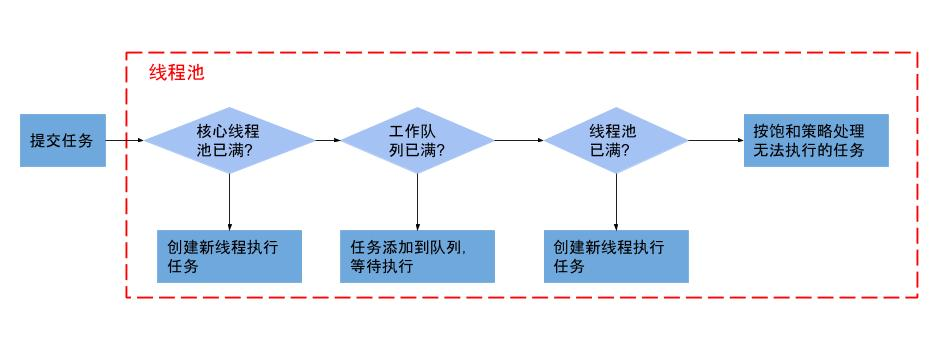

#   JUC

## 1. JUC简介

​	JUC是java.util .concurrent工具包的简称。这是一个处理线程的工具包，JDK 1.5开始出现的。在此包中增加了在并发编程中很常用 的实用工具类，用于定义类似于线程的自定义子 系统，包括线程池、异步 IO 和轻量级任务框架。 提供可调的、灵活的线程池。还提供了设计用于 多线程上下文中的 Collection 实现等。

## **2. 进程和线程**

​	进程：进程是一个具有独立功能的程序关于某个集合的一次运行活动。它是操作系统动态执行的基本单元。

​	线程：是进程的一个实体,是CPU调度和分派的基本单位,它是比进程更小的能独立运行的基本单位。

## 3. 线程状态

```java
NEW、RUNNABLE、BLOCKED、WAITING、TIMED_WAITING、TERMINATED
```


## 4. Synchoronized关键字

## 5. Lock接口

## 6. 线程间通信

## 7. 多线程锁

## 8. Callable接口

## 9. JUC辅助工具类

## 10.ReentrantReadWriteLock（读写锁）

## 11.BlockingQueue阻塞队列

## 12.ThreadPool线程池

#### 12.1 线程池创建方式

```java
Executors.newFixedThreadPool(int i);//执行长期任务，有固定数的线程
	public static ExecutorService newFixedThreadPool(int var0) {
	        return new ThreadPoolExecutor(nThreads, nThreads, 0L, 					TimeUnit.MILLISECONDS, new LinkedBlockingQueue<Runnable>());
	}
Executors.newSingleThreadExecutor();//一个线程池一个线程。创建一个单线程的线程池，适用于需要保证顺序执行各个任务。
	public static ExecutorService newSingleThreadExecutor(int var0) {
	        return new ThreadPoolExecutor(1, 1, 0L, 					TimeUnit.MILLISECONDS, new LinkedBlockingQueue<Runnable>());
	}
Executors.newCachedThreadPool();//执行短期任务，根据需要创建线程，可扩容
	public static ExecutorService newSingleThreadExecutor(int var0) {
	        return new ThreadPoolExecutor(0, Integer.MAX_VALUE, 0L, 					TimeUnit.MILLISECONDS, new LinkedBlockingQueue<Runnable>());
	}
```

#### 12.2 特点与优势

- 线程复用、控制并发数、管理线程

- 降低资源消耗、提高响应速度、提高线程可管理性

#### **12.3 线程池参数**

```java
public ThreadPoolExecutor(int corePoolSize, int maximumPoolSize, long keepAliveTime, TimeUnit unit, BlockingQueue<Runnable> workQueue) {
    this(corePoolSize, maximumPoolSize, keepAliveTime, unit, workQueue,
         Executors.defaultThreadFactory(), defaultHandler);
}
```

```te
corePoolSize:线程池中核心线程数。
maximumPoolSize:线程池中能容纳同时执行的最大线程数，必须大于1。
keepAliveTime:线程存活保持时间。当线程池中线程数(maximumPoolSize)大于核心线程数(corePoolSize)时，线程的空闲时间如果超过线程存活时间，那么这个线程就会被销毁，直到线程池中的线程数小于等于核心线程数。
unit:keepAliveTime的队列。
workQueue:任务队列，被提交但未执行的任务。
threadFactory:表示生成线程池中工作线程的线程工厂。同于创建线程。threadFactory创建的线程也是采用new Thread()方式，threadFactory创建的线程名都具有统一的风格：pool-m-thread-n（m为线程池的编号，n为线程池内的线程编号）。默认即可。
defaultHandler:拒绝策略。当线程池和队列都满了，再加入线程会执行此策略。工作线程大于等于线程池的最大线程数(maximumPoolSize)时，采用一定的策略拒绝请求。
```

#### 12.4 线程池工作原理



```te

```

#### 12.5 拒绝策略

```te
AbortPolicy:默认。直接抛出异常，阻止系统正常运行
CallerRunsPolicy:“调用者运行”一种调节机制，该策略不会抛弃任务，也不抛出异常，将某些任务回退给调用者，从而降低新任务流量。
DiscardOldestPolicy:抛弃队列中等待时间最久的任务，然后把当前任务加入到队列中再尝试提交。
DiscardPolicy:丢弃无法处理的任务，不抛出异常也不做任何处理。如果允许任务丢失，可以使用此策略。
```

#### 12.6 如何配置线程池

```te
CPU密集型任务:尽量使用较小的线程池，一般为CPU核心数+1。
IO密集型任务:可以使用稍大的线程池，一般为2*CPU核心数。
混合型任务:可以将任务分成IO密集型和CPU密集型任务，然后分别用不同的线程池去处理。
```


​					


​			

## 13.分支合并框架

## 14.异步回调